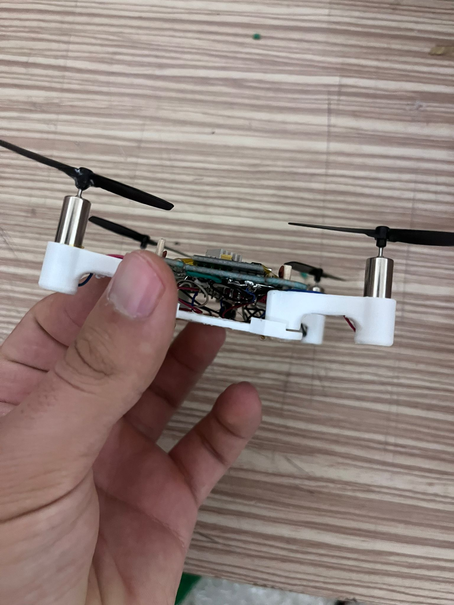

# ESP32-S3 Micro Drone (NanoCore Flight System)

Bu proje, **ESP32-S3 Super Mini** geliştirme kartı ve **MPU6050 IMU** sensörü kullanan, fırçalı (brushed) motorlara sahip mikro boyutlu bir quadcopter (drone) projesidir. Sistem, 250Hz döngü hızı, tamamlayıcı filtre (Complementary Filter) ile açı kararlılaştırma, PID kontrolcü ve dahili siberpunk tasarımlı Web HUD arayüzü ile donatılmıştır. 

Dronu hem tarayıcınızdan (WebSockets üzerinden) hem de bilgisayarınıza bağlayacağınız bir **Gamepad (Oyun Kolu)** yardımıyla kontrol edebilirsiniz.

---

## 📌 İçindekiler
1. [Gerekli Malzemeler](#1-gerekli-malzemeler)
2. [Elektronik ve Lehimleme Kılavuzu](#2-elektronik-ve-lehimleme-kılavuzu)
3. [Motor ve Pervane Yönleri](#3-motor-ve-pervane-yönleri)
4. [Mekanik Montaj ve Genel Görünüm](#4-mekanik-montaj-ve-genel-görünüm)
5. [Yazılım Kurulumu](#5-yazılım-kurulumu)
6. [Kullanım ve Kontrol Arayüzleri](#6-kullanım-ve-kontrol-arayüzleri)
7. [Testler ve Hata Giderme](#7-testler-ve-hata-giderme)

---

## 1. Gerekli Malzemeler

Projede kullanılan temel bileşenler aşağıda listelenmiştir. Malzemelerin görsel yerleşimi için `img/malzemeler.jpg` dosyasına bakabilirsiniz.


*   **Kontrolcü:** ESP32-S3 Super Mini Geliştirme Kartı
*   **Sensör (IMU):** MPU6050 (Gyro & İvmeölçer)
*   **Motorlar:** 4x 8.5x20mm (veya 7x20mm) Fırçalı (Coreless) Motorlar (2x CW, 2x CCW)
*   **Güç Sürücüsü:** 4x SI2302 N-Kanal MOSFET (SOT-23 kılıf)
*   **Pasif Bileşenler:** 
    *   4x 10kΩ Pull-down direnci (MOSFET Gate koruması için)
    *   4x Flyback Diyotu (1N4148 vb. hızlı diyotlar, motorların indüktif akımını engellemek için)
*   **Güç Kaynağı:** 1S 3.7V 300mAh - 500mAh LiPo Batarya
*   **Gövde:** 3D Yazıcı ile basılmış gövde kiti (Görsel için bkz: `img/3dkit.jpg`)

---

## 2. Elektronik ve Lehimleme Kılavuzu

Projenin en hassas noktası küçük alanda yapılan MOSFET ve direnç lehimlemeleridir. Güç hattı ve sinyal hatları için aşağıdaki şemaları ve görselleri referans alınız.

### MOSFET Bacak Yapısı ve Konumlandırma
Fırçalı motorları sürmek için kullanılan N-Kanal MOSFET bacak bağlantıları `img/mosfetkonumlandırma.jpg` görselinde gösterilmiştir.


*   **Gate (G):** ESP32'den gelen kontrol pini (10kΩ direnç ile GND'ye çekilmelidir).
*   **Source (S):** Doğrudan Batarya Negatif kutbuna (GND / Batarya -) bağlanır.
*   **Drain (D):** Motorun eksi (-) kutbuna bağlanır. Motorun artı (+) kutbu ise doğrudan Batarya artı (+) hattına gider.
*   *Önemli:* Motor uçlarına paralel olarak ters yönde flyback diyotu yerleştirmek ESP32'nin reset atmasını önler.

### Detaylı Lehimleme Rehberi (Üst ve Alt Görünüm)
Lehimleme yolları, güç dağıtımı ve MPU6050 bağlantı kabloları için `img/lehimlemetop.jpg` (Üst görünüm) ve `img/lehimlemeback.jpg` (Alt görünüm) görsellerini kılavuz olarak kullanabilirsiniz.

| Kartın Üst Görünümü (Top) | Kartın Alt Görünümü (Back) |
|:---:|:---:|
|  |  |

### ESP32-S3 Sinyal Bağlantı Tablosu

| Bileşen | Bağlantı Pini (ESP32-S3) | Açıklama |
| :--- | :---: | :--- |
| **MPU6050 SDA** | `GPIO 8` | I2C Veri Hattı |
| **MPU6050 SCL** | `GPIO 9` | I2C Saat Hattı |
| **Motor 1 (Ön Sol)** | `GPIO 10` | MOSFET Sürücü Sinyali (CCW) |
| **Motor 2 (Ön Sağ)** | `GPIO 7` | MOSFET Sürücü Sinyali (CW) |
| **Motor 3 (Arka Sol)** | `GPIO 11` | MOSFET Sürücü Sinyali (CW) |
| **Motor 4 (Arka Sağ)** | `GPIO 6` | MOSFET Sürücü Sinyali (CCW) |
| **Dahili LED** | `GPIO 47` | Durum / Kalibrasyon LED'i |

---

## 3. Motor ve Pervane Yönleri

Drone "Quad X" konfigürasyonuna göre çalışmaktadır. Motorların dönüş yönleri ve takılacak pervaneler (saat yönü CW veya saat yönünün tersi CCW) uçuş stabilitesi için kritik öneme sahiptir:

*   **Motor 1 (Ön Sol):** CCW (Saat yönünün tersi döner - Siyah/Beyaz kablolu motor kullanılır, pervanesi CCW'dir).
*   **Motor 2 (Ön Sağ):** CW (Saat yönüne döner - Kırmızı/Mavi kablolu motor kullanılır, pervanesi CW'dir).
*   **Motor 3 (Arka Sol):** CW (Saat yönüne döner - Kırmızı/Mavi kablolu motor kullanılır, pervanesi CW'dir).
*   **Motor 4 (Arka Sağ):** CCW (Saat yönünün tersi döner - Siyah/Beyaz kablolu motor kullanılır, pervanesi CCW'dir).

---

## 4. Mekanik Montaj ve Genel Görünüm

Bileşenlerin lehimlenmesi bittikten sonra 3D basılmış gövde içerisine yerleştirilir. 3D gövde detayları ve montaj bittikten sonraki nihai görünümler aşağıdaki gibidir:

| Görünüm | Görsel Referansı |
| :--- | :--- |
| **3D Parçalar** |  |
| **Ön (Front)** |  |
| **Arka (Back)** |  |
| **Üst (Top)** |  |
| **Alt (Bottom)** |  |

---

## 5. Yazılım Kurulumu

Projede yer alan kodları ESP32-S3 kartınıza yüklemek için aşağıdaki adımları izleyin.

### ESP32-S3 Firmware Yüklemesi (`droneeee.ino`)
1. Arduino IDE uygulamasını açın.
2. **Kart Yöneticisinden** ESP32 paketinin kurulu olduğundan emin olun (Önerilen sürüm: v3.0+).
3. Gerekli harici kütüphaneleri yükleyin:
   * **WebSockets** (Markus Sattler tarafından geliştirilen kütüphane)
4. Araçlar (Tools) menüsünden aşağıdaki ayarları yapın:
   * **Board:** "ESP32S3 Dev Module" veya "ESP32-S3 Super Mini"
   * **USB CDC On Boot:** "Enabled" (Seri haberleşmenin USB üzerinden çalışması için)
5. `droneeee.ino` dosyasını açın ve ESP32-S3 kartınıza yükleyin.

---

## 6. Kullanım ve Kontrol Arayüzleri

Drone iki farklı yöntemle uzaktan kontrol edilebilir:

### A. Siberpunk Web Panel Kontrolü (Kablosuz)
Drone açıldığında kendi Wi-Fi erişim noktasını (AP) oluşturur.
*   **Wi-Fi Adı (SSID):** `DRONE-NEXTGEN`
*   **Şifre:** `dronecontrol`
*   **Bağlantı Adresi:** Tarayıcınızdan `http://192.168.4.1` adresine gidin.

Web arayüzü **NanoCore Command Shell** olarak adlandırılan premium, fütüristik bir tasarıma sahiptir:
*   **Yapay Ufuk (Attitude Indicator):** Drone üzerindeki MPU6050 ivmeölçer verilerini alıp gerçek zamanlı olarak drone eğimini görselleştirir.
*   **Telemetri Paneli:** Pitch, Roll, Yaw açılarını ve anlık gaz (Throttle) seviyesini gösterir.
*   **Dokunmatik Joystickler:** Telefon veya tabletten kontrol için ekran üzerinde sol (Gaz/Yaw) ve sağ (Pitch/Roll) joystick bulunur.
*   **IMU Kalibrasyon Butonu:** İlk açılışta düz bir zeminde kalibrasyon yapmak için kullanılır.
*   **Arm / Disarm:** Motorları güvenli bir şekilde kilitlemek ya da uçuşa hazırlamak için kullanılır.

### B. Python ve Gamepad (Oyun Kolu) Kontrolü (Kablolu Serial)
Eğer dronu bilgisayara USB kablosuyla bağlıyken doğrudan bir fiziksel oyun kolu (Xbox, PlayStation vb.) ile kontrol etmek isterseniz:

1. Gerekli python paketlerini yükleyin:
   ```bash
   pip install pygame pyserial
   ```
2. Oyun kolunu bilgisayara bağlayın.
3. `drone_controller.py` dosyasını çalıştırın:
   ```bash
   python drone_controller.py
   ```
4. Kod, ESP32'nin bağlı olduğu COM portunu otomatik tespit edecektir.
5. **Kontroller:**
   *   **Sol Analog (Yukarı/Aşağı):** Gaz (Throttle - 0 ile 255 arası)
   *   **Sol Analog (Sağ/Sol):** Yaw (Dönüş)
   *   **Sağ Analog (Yukarı/Aşağı):** Pitch (İleri/Geri)
   *   **Sağ Analog (Sağ/Sol):** Roll (Sağa/Sola yatma)
   *   **A Butonu:** Arm / Disarm (Motor Kilidi Açma/Kapatma)

---

## 7. Testler ve Hata Giderme

Montaj sonrasında aşama aşama test yapılması olası donanımsal hataların önüne geçer.

### 1. Wi-Fi Yayını Testi (`wifi_test/wifi_test.ino`)
Bu temel kod, ESP32'nin Wi-Fi modülünün çalışıp çalışmadığını doğrulamak içindir. Kodu yükledikten sonra telefonunuzdan `DRONE-TEST` isimli Wi-Fi ağını görebiliyor olmanız gerekir.

### 2. Motor ve MOSFET Sürücü Testi (`motor_test/motor_test.ino`)
MOSFET'lerin doğru tetiklenip tetiklenmediğini ve motor dönüş yönlerini test etmek için bu kodu kullanabilirsiniz:
*   Kodu yükledikten sonra sistem sadece **1. Motoru (Pin 10)** düşük bir hızda (güç: 50) çalıştırırken diğer motorları kapalı tutacaktır.
*   Her motor pinini sırasıyla test ederek bağlantıların doğruluğundan emin olabilirsiniz.

### Güvenlik Failsafe Özellikleri (Firmware)
*   **Crash / Tumble Detection:** Drone uçuş esnasında **55 dereceden** fazla yan yatarsa veya takla atarsa, motor gücü güvenlik nedeniyle anında kesilir (Disarm olur).
*   **Watchdog / Sinyal Kaybı Failsafe:** Python veya Web arayüzü ile bağlantı koptuğunda (en son komutun üzerinden belirli bir süre geçtiğinde) drone motorları acil durdurma (acilStop) moduna geçirir.

---
*Keyifli uçuşlar! 🛸*
