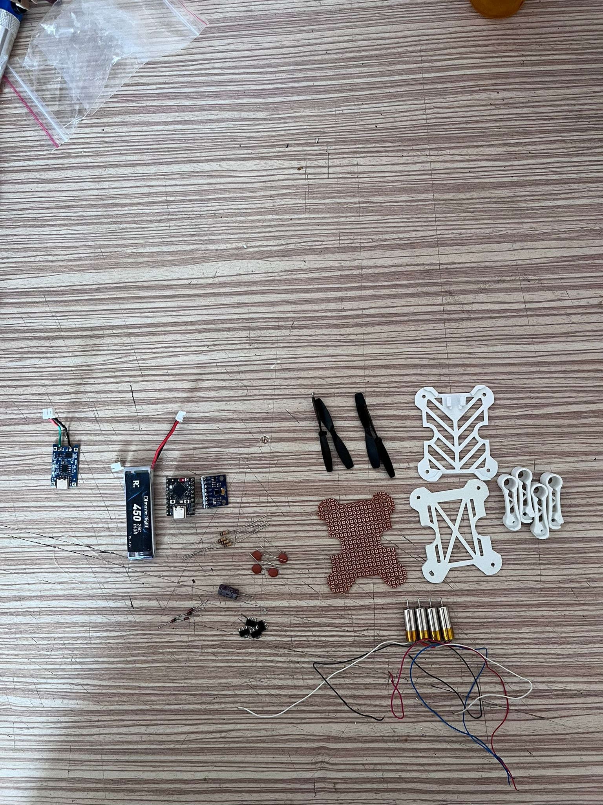
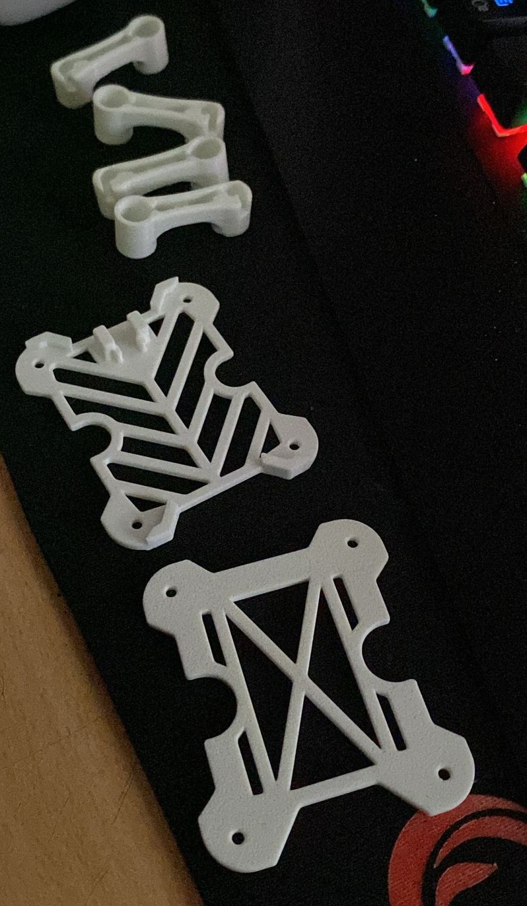
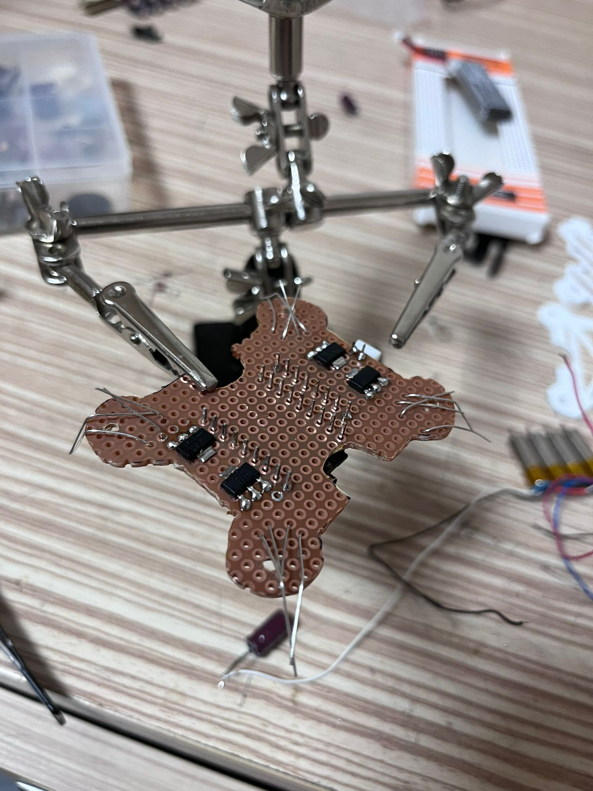
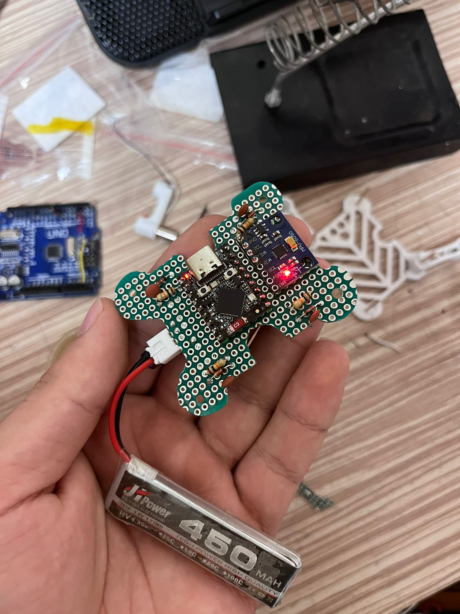
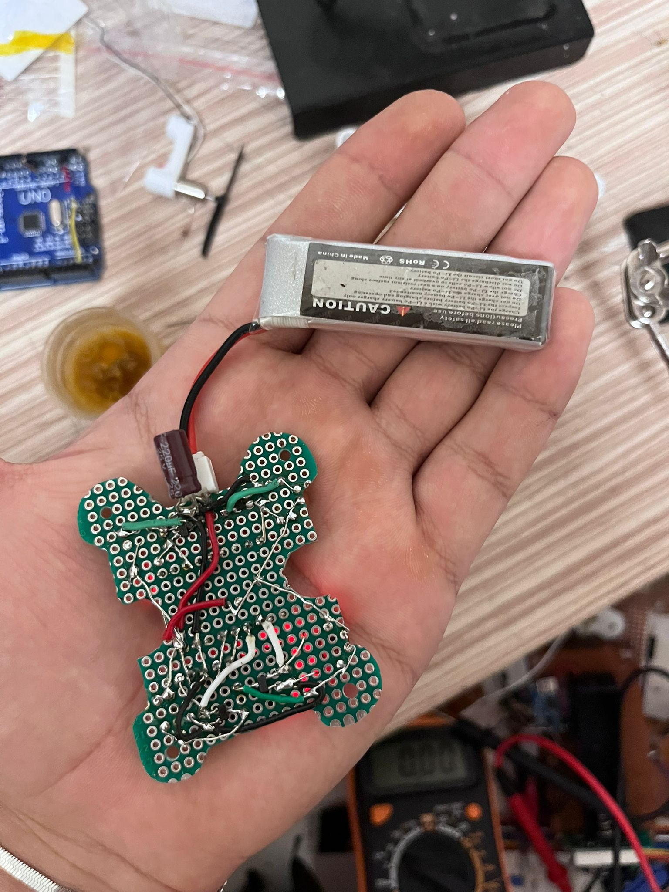
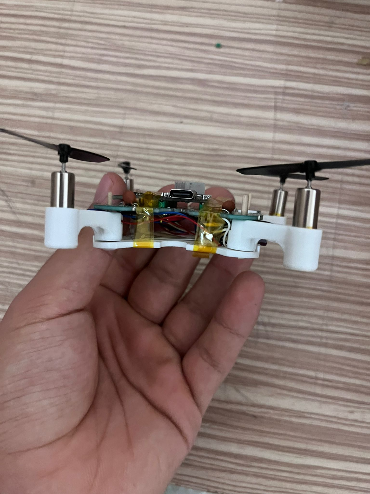
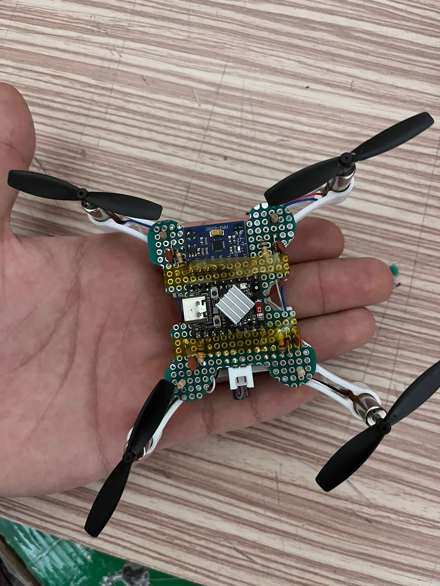
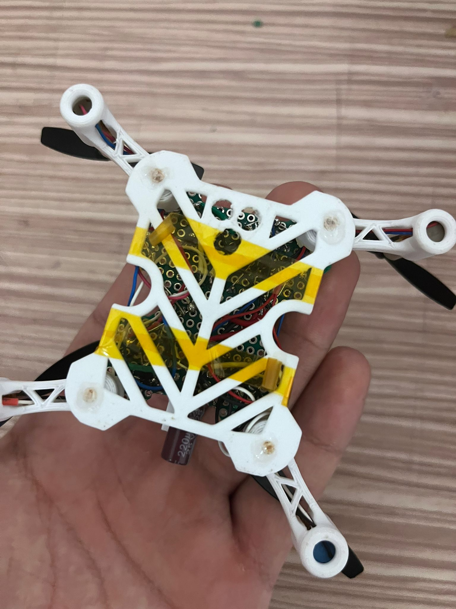

<div align="center">

# 🚁 ESP32-S3 Micro Drone
### *NanoCore Flight System*


**ESP32-S3 Super Mini** tabanlı, **NRF24L01** radyo haberleşmeli, **MPU6050** IMU sensörlü,  
Tamamlayıcı Filtre + PID stabilizasyonlu profesyonel mikro quadcopter projesi.

[🚀 Hızlı Başlangıç](#-hızlı-başlangıç) · [📐 Donanım](#-donanım) · [💻 Yazılım](#-yazılım) · [🎮 Kontrol](#-kontrol) · [🔧 Sorun Giderme](#-sorun-giderme)

</div>

---

## ✨ Özellikler

| Özellik | Detay |
|---|---|
| 🧠 **Ana İşlemci** | ESP32-S3 Super Mini (Dual-Core, 240MHz) |
| 📡 **Haberleşme** | NRF24L01+ (2.4GHz, 250KBPS, ~1km menzil) |
| 🔄 **IMU** | MPU6050 — Gyro + İvmeölçer (I2C @ 400kHz) |
| ⚡ **Döngü Hızı** | 500 Hz uçuş kontrol döngüsü |
| 🎛️ **Stabilizasyon** | Tamamlayıcı Filtre (98% gyro / 2% acc) |
| 📊 **PID Kontrolcü** | Roll / Pitch / Yaw bağımsız PID |
| 🛡️ **Güvenlik** | WiFi Watchdog Failsafe + Kademeli Motor Durdurma |
| 🖥️ **Kontrol Arayüzü** | Python + PS4/Xbox Gamepad (PyGame) |
| ⚙️ **Çoklu Çekirdek** | Core 0: NRF İletişim · Core 1: Uçuş Kontrolü |
| 🔋 **Güç** | 1S LiPo 3.7V 300–500mAh |

---

## 📁 Proje Yapısı

```
esp32MicroDronee/
│
├── 📂 droneeee/                   # Ana drone firmware'i
│   ├── droneeee.ino               # ESP32-S3 uçuş kontrol kodu (540 satır)
│   └── index_html.h               # Web HUD arayüzü (header dosyası)
│
├── 📂 transmitter/                # NRF24L01 verici (Arduino Uno/Nano)
│   └── transmitter.ino            # Verici kodu — Serial → NRF köprüsü
│
├── 📂 python_controller/          # PC taraflı kontrol yazılımı
│   ├── ps4_drone_control.py       # PS4 DualShock kontrolcü desteği
│   ├── pc_drone_control.py        # Genel PC gamepad kontrolcüsü
│   └── test_joystick.py           # Joystick test aracı
│
├── 📂 motor_test/                 # MOSFET & motor doğrulama
│   └── motor_test.ino             # Tekil motor test kodu
│
├── 📂 wifi_test/                  # WiFi modül doğrulama
│   └── wifi_test.ino              # Basit AP yayın testi
│
├── 📂 img/                        # Donanım görselleri & fotoğraflar
│   ├── malzemeler.jpg
│   ├── mosfetkonumlandırma.jpg
│   ├── lehimlemetop.jpg / lehimlemeback.jpg
│   ├── front.jpg / back.jpg / top.jpg / bottom.jpg
│   └── 3dkit.jpg
│
└── drone_controller.py            # Alternatif genel kontrolcü
```

---

## 📐 Donanım

### Gerekli Malzemeler

| # | Bileşen | Model / Değer | Adet |
|---|---|---|---|
| 1 | **Mikrodenetleyici** | ESP32-S3 Super Mini | 1 |
| 2 | **IMU Sensör** | MPU6050 (Gyro + İvmeölçer) | 1 |
| 3 | **Radyo Modülü** | NRF24L01+ (veya PA+LNA versiyonu) | 2 |
| 4 | **Motorlar (CW)** | 8.5×20mm Coreless Fırçalı Motor | 2 |
| 5 | **Motorlar (CCW)** | 8.5×20mm Coreless Fırçalı Motor | 2 |
| 6 | **Motor Sürücü** | SI2302 N-Kanal MOSFET (SOT-23) | 4 |
| 7 | **Pull-down Direnç** | 10kΩ (MOSFET Gate koruması) | 4 |
| 8 | **Flyback Diyotu** | 1N4148 Hızlı Diyot | 4 |
| 9 | **Batarya** | 1S LiPo 3.7V, 300–500mAh | 1 |
| 10 | **Gövde** | 3D Basılı Quadcopter Çerçevesi | 1 set |
| 11 | **Verici İşlemci** | Arduino Uno / Nano (NRF köprüsü için) | 1 |

> 📷 Görsel referans için `img/malzemeler.jpg` dosyasına bakın.

---

### 🔌 Pin Bağlantı Şeması

#### ESP32-S3 → Drone Bağlantıları

| Bileşen | GPIO | Açıklama |
|---|---|---|
| **MPU6050 SDA** | `GPIO 12` | I2C Veri Hattı |
| **MPU6050 SCL** | `GPIO 13` | I2C Saat Hattı |
| **NRF24L01 CE** | `GPIO 1` | Chip Enable |
| **NRF24L01 CSN** | `GPIO 2` | SPI Chip Select |
| **NRF24L01 SCK** | `GPIO 3` | SPI Clock |
| **NRF24L01 MOSI** | `GPIO 4` | SPI MOSI |
| **NRF24L01 MISO** | `GPIO 5` | SPI MISO |
| **Motor 1 (Ön Sol — CCW)** | `GPIO 10` | MOSFET PWM Sinyali |
| **Motor 2 (Ön Sağ — CW)** | `GPIO 7` | MOSFET PWM Sinyali |
| **Motor 3 (Arka Sol — CW)** | `GPIO 11` | MOSFET PWM Sinyali |
| **Motor 4 (Arka Sağ — CCW)** | `GPIO 6` | MOSFET PWM Sinyali |
| **Durum LED** | `GPIO 47` | Kalibrasyon / Durum Göstergesi |

#### Arduino Uno/Nano → NRF24L01 Verici Bağlantıları

| NRF24L01 | Arduino Pin |
|---|---|
| CE | `D9` |
| CSN | `D10` |
| SCK | `D13` (HW SPI) |
| MOSI | `D11` (HW SPI) |
| MISO | `D12` (HW SPI) |

---

### ⚡ MOSFET Motor Sürücü Devresi

Motor sürücü olarak **SI2302 N-Kanal MOSFET** kullanılmaktadır. Her motor için:

```
ESP32 GPIO ──[10kΩ]──┬── Gate (G)
                     │
                    GND

           Drain (D) ──── Motor (–)
           Source (S) ─── GND / Batarya (–)

           Motor (+) ──── Batarya (+)
           Motor (–) ──┬─ Drain (D)
                       └─[1N4148 Ters]── Batarya (+)   ← Flyback koruması
```

> ⚠️ **Flyback diyotunu atlamayın!** Motor kapanırken oluşan indüktif gerilim tepkisi ESP32'yi resetler veya kalıcı olarak hasar verebilir.

> 📷 Görsel için `img/mosfetkonumlandırma.jpg` dosyasına bakın.

---

### 🔄 Motor ve Pervane Konfigürasyonu (Quad X)

```
        ÖN
    
  [M1 CCW] ← ← ← ← ← [M2 CW]
      ↑   ╲           ╱   ↑
      |     ╲    X   ╱     |
      |      ╲       ╱      |
  [M3 CW]  → → → → →  [M4 CCW]
  
        ARKA
```

| Motor | Konum | Yön | PWM Pin |
|---|---|---|---|
| M1 | Ön Sol | **CCW** ↺ | GPIO 10 |
| M2 | Ön Sağ | **CW** ↻ | GPIO 7 |
| M3 | Arka Sol | **CW** ↻ | GPIO 11 |
| M4 | Arka Sağ | **CCW** ↺ | GPIO 6 |

---

## 💻 Yazılım

### Mimari Genel Bakış

```
┌─────────────────────────────────────────┐
│           ESP32-S3 (Drone)              │
│                                         │
│  ┌──────────────┐  ┌──────────────────┐ │
│  │   Core 0     │  │     Core 1       │ │
│  │              │  │                  │ │
│  │ NRF24L01     │  │ MPU6050 → Okuma  │ │
│  │ RX/TX        │  │ Comp. Filter     │ │
│  │ Payload Parse│  │ PID Compute      │ │
│  │ Failsafe RST │  │ Motor Mix        │ │
│  └──────┬───────┘  └────────┬─────────┘ │
│         │   volatile vars   │           │
│         └─────────┬─────────┘           │
│               500Hz Loop                │
└─────────────────────────────────────────┘
          ↑ NRF24L01 (2.4GHz, 250KBPS)
          ↓ ACK Payload (Telemetri)
┌─────────────────────────────────────────┐
│     Arduino Nano/Uno (Verici Köprüsü)   │
│  Serial (USB) ←→ NRF24L01              │
│  Format: T:xxx,P:xxx,R:xxx,Y:xxx,C:x   │
└─────────────────────────────────────────┘
          ↑ USB Serial (115200 baud)
          ↓
┌─────────────────────────────────────────┐
│      Python Controller (PC)             │
│  PyGame → Gamepad Input                 │
│  PS4 / Xbox / Generic Gamepad           │
│  Telemetri Dashboard (Gerçek Zamanlı)   │
└─────────────────────────────────────────┘
```

### PID Parametreleri

```cpp
// Roll & Pitch
Kp = 1.80,  Ki = 0.04,  Kd = 0.40

// Yaw
Kp = 2.50,  Ki = 0.05,  Kd = 0.00
```

### Tamamlayıcı Filtre (Attitude Estimation)

```
roll_angle  = 0.98 × (roll_angle + gyro_rate × dt) + 0.02 × acc_roll
pitch_angle = 0.98 × (pitch_angle + gyro_rate × dt) + 0.02 × acc_pitch
```

---

## 🚀 Hızlı Başlangıç

### 1️⃣ Arduino IDE Kurulumu

1. [Arduino IDE 2.x](https://www.arduino.cc/en/software) indirip kurun.
2. **Dosya → Tercihler → Ek Kart URL'leri** alanına ekleyin:
   ```
   https://raw.githubusercontent.com/espressif/arduino-esp32/gh-pages/package_esp32_index.json
   ```
3. **Araçlar → Kart → Kart Yöneticisi** → `esp32` aratın → **Kurulum** (v3.0+).

### 2️⃣ Gerekli Kütüphaneler

**Kütüphane Yöneticisinden** (`Araçlar → Kütüphaneler`) yükleyin:

| Kütüphane | Yazar | Kullanım |
|---|---|---|
| `RF24` | TMRh20 | NRF24L01 radyo modülü |

### 3️⃣ Drone Firmware Yükleme (`droneeee.ino`)

1. `droneeee/droneeee.ino` dosyasını Arduino IDE ile açın.
2. **Araçlar** menüsünden ayarlayın:
   - **Kart:** `ESP32S3 Dev Module`
   - **USB CDC On Boot:** `Enabled`
   - **Upload Speed:** `921600`
3. ESP32-S3'ü USB ile bağlayın ve **Yükle** butonuna basın.
4. Yükleme sonrası Seri Monitörü açın (115200 baud) — kalibrasyon otomatik başlar.

### 4️⃣ Verici Kurulumu (`transmitter.ino`)

1. `transmitter/transmitter.ino` dosyasını Arduino IDE ile açın.
2. **Kart:** `Arduino Uno` veya `Arduino Nano` seçin.
3. Arduino'yu USB ile bağlayın ve **Yükle** butonuna basın.

### 5️⃣ Python Kontrolcü Kurulumu

```bash
# Gerekli paketleri yükleyin
pip install pygame pyserial

# PS4 kontrolcü ile kullanmak için
python python_controller/ps4_drone_control.py

# Genel PC gamepad ile
python python_controller/pc_drone_control.py

# Sadece joystick testi
python python_controller/test_joystick.py
```

---

## 🎮 Kontrol

### Gamepad Kontrol Şeması (PS4 / Xbox)

```
     L2 (Arm/Disarm)                    R2
         ●                                ●
    ┌────────────────────────────────────────┐
    │  ┌──┐                          ┌──┐   │
    │  │L3│ Sol Analog               │R3│   │
    │  └──┘                          └──┘   │
    │   ↕ Throttle (Gaz)              ↕ Pitch (İleri/Geri) │
    │   ↔ Yaw (Sola/Sağa Dön)        ↔ Roll (Yatma)       │
    └────────────────────────────────────────┘
         ●
     □ / X (Kalibrasyon)
```

| Kontrol | Eylem |
|---|---|
| **Sol Analog — Yukarı/Aşağı** | Throttle (Gaz: 0–255) |
| **Sol Analog — Sağ/Sol** | Yaw (Yaw Rate: ±90°/s) |
| **Sağ Analog — Yukarı/Aşağı** | Pitch (İleri/Geri: ±20°) |
| **Sağ Analog — Sağ/Sol** | Roll (Yatma: ±20°) |
| **L2 / Kare Butonu** | Arm / Disarm |
| **Üçgen / Kalibrasyon** | IMU Kalibrasyon Komutu |

### Serial Protokol (Transmitter ↔ Python)

```
# PC → Arduino (Komut Gönderme)
T:150,P:10,R:-5,Y:0,C:0
  │     │   │    │   └─ cmd (0=normal, 1=kalibre)
  │     │   │    └───── yaw (-100..+100)
  │     │   └────────── roll (-100..+100)
  │     └────────────── pitch (-100..+100)
  └──────────────────── throttle (0..255)

# Arduino → PC (Telemetri)
TEL:P:2.3,R:-1.1,Y:45.0,S:2
          │      │        └─ cal_status (0=normal, 1=kalibre ediliyor, 2=tamamlandı)
          │      └─────────── yaw (derece)
          └────────────────── roll (derece)
```

---

## 🛡️ Güvenlik Özellikleri

```
┌─────────────────────────────────────┐
│         GÜVENLİK KATMANLARı         │
├─────────────────────────────────────┤
│ 1. NRF Watchdog Failsafe            │
│    → 500ms sinyal yoksa kademeli    │
│      motor durdurma (ramp-down)     │
│    → 255 → 0 → ~85ms'de durur      │
├─────────────────────────────────────┤
│ 2. Crash / Tumble Detection         │
│    → Eğim > 55° → Anında disarm    │
├─────────────────────────────────────┤
│ 3. I2C Hata Koruma                  │
│    → 10+ I2C hatası → Motor kapatma│
├─────────────────────────────────────┤
│ 4. Kalibrasyon Güvenliği            │
│    → Gaz > 5 iken kalibrasyon yok  │
├─────────────────────────────────────┤
│ 5. PID Integral Anti-Windup         │
│    → I-term ±40 ile sınırlandırıldı│
└─────────────────────────────────────┘
```

---

## 🔧 Sorun Giderme

### Test Prosedürü (Sırasıyla Yapın)

#### Adım 1 — WiFi Modül Testi
`wifi_test/wifi_test.ino` dosyasını yükleyin. Telefonunuzda `DRONE-TEST` Wi-Fi ağı görünüyorsa ESP32 çalışıyor demektir.

#### Adım 2 — Motor & MOSFET Testi
`motor_test/motor_test.ino` dosyasını yükleyin. **Yalnızca Motor 1 (GPIO 10)** düşük güçte (50/255) çalışır. Diğer motorları sırasıyla test edin.

#### Adım 3 — NRF Haberleşme Testi
Vericiyi (Arduino) ve dronu aynı anda çalıştırın. Seri monitörde `TEL:P:...` satırlarını görüyorsanız NRF haberleşmesi kurulmuştur.

### Yaygın Sorunlar

| Sorun | Olası Neden | Çözüm |
|---|---|---|
| Motor dönmüyor | MOSFET lehim soğuk / yanlış bağlantı | Lehim noktalarını kontrol edin, `motor_test.ino` çalıştırın |
| Drone sallanıyor / kontrolsüz | Pervane yönü yanlış | CW/CCW pervane yerleşimini kontrol edin |
| MPU6050 YOK mesajı | I2C kablo veya adres sorunu | SDA=GPIO12, SCL=GPIO13 bağlantısını doğrulayın |
| NRF BULUNAMADI | SPI bağlantı hatası veya 3.3V güç sorunu | NRF'e 3.3V (max 3.6V!) uygulayın, pin bağlantısını kontrol edin |
| Python `pyserial` bulamıyor | COM port izni | Arduino IDE'yi kapatın, Python'ı yönetici olarak çalıştırın |
| Failsafe sürekli tetikleniyor | NRF menzil dışı veya kanal çakışması | `radio.setChannel(108)` her iki tarafta aynı olduğundan emin olun |
| Kalibrasyon başarısız | Drone titreşiyor / düz değil | Dronu düz, sabit bir yüzey üzerine koyun ve tekrar deneyin |

### Seri Monitör Hata Referansı

```
[CAL] Kalibrasyon basliyor...  → Normal, bekleme yapın
[CAL] OK! Offsets: ...         → Kalibrasyon başarılı ✅
[CAL] BASARISIZ!               → Tekrar deneyin, dronu sabit tutun
[FAILSAFE] WiFi timeout!       → NRF bağlantısı kesildi ⚠️
[FAILSAFE] NRF Baglanti geldi! → Bağlantı yeniden kuruldu ✅
NRF24L01 BULUNAMADI!           → Donanım bağlantı hatası ❌
MPU6050 YOK                    → PID'siz kaba kontrol modu
```

---

## 📊 Performans Metrikleri

| Metrik | Değer |
|---|---|
| **Uçuş Kontrol Döngüsü** | 500 Hz (2ms/döngü) |
| **NRF Paket Gönderme** | ~20 Hz (50ms aralık) |
| **NRF Veri Hızı** | 250 KBPS |
| **NRF Kanal** | 108 (2.508 GHz — WiFi'den uzak) |
| **Failsafe Tepki Süresi** | < 500ms |
| **Motor Ramp-down Süresi** | ~170ms (255 → 0) |
| **IMU Kalibrasyonu** | 1000 örnek (~2 saniye) |
| **Tamamlayıcı Filtre Alpha** | 0.98 (Gyro ağırlığı) |

---

## 📷 Proje Görselleri

| | | |
|---|---|---|
|  |  |  |
| *Gerekli Malzemeler* | *3D Basılı Çerçeve* | *MOSFET Yerleşimi* |
|  |  |  |
| *Üst Lehimleme* | *Alt Lehimleme* | *Python Kontrol Paneli* |
|  |  |  |
| *Ön Görünüm* | *Üst Görünüm* | *Alt Görünüm* |

---

## 🛠️ Geliştirme Yol Haritası

- [x] NRF24L01 radyo haberleşmesi
- [x] MPU6050 + Tamamlayıcı Filtre
- [x] PID Stabilizasyonu (Roll/Pitch/Yaw)
- [x] Çift çekirdek mimari (Core 0/1)
- [x] Python + Gamepad kontrolü
- [x] Watchdog Failsafe
- [ ] Barometrik irtifa tutma (BMP280)
- [ ] GPS tabanlı konum tutma
- [ ] Otonom görev planlama
- [ ] Telemetri veri kaydı (SD Kart)
- [ ] OTA (Over-The-Air) firmware güncelleme

---

## 📄 Lisans

Bu proje **MIT Lisansı** ile lisanslanmıştır. Detaylar için [LICENSE](LICENSE) dosyasına bakın.

---

<div align="center">

Keyifli uçuşlar! 🛸

*ESP32-S3 NanoCore Flight System — Mikro Boyut, Maksimum Kontrol*

</div>
